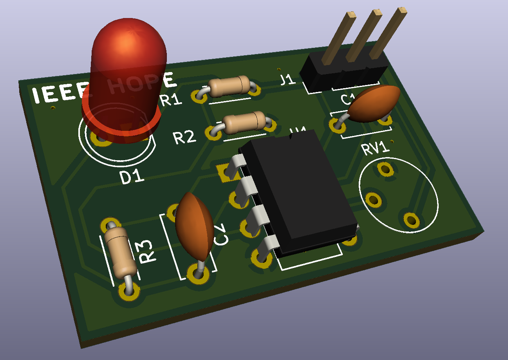

======================
KiCad Introduction Lab
======================

------
Week 1
------

:authors: Kevin Zheng, Leon Wu, Jeffrey Ni
:originally by: Kevin Zheng, Hall Chen, Olivia Hsu
:date: 2019-09-04

In this lab, we will build a printed circuit board (PCB) for the LED light
sensor talked about during lecture. Don't feel like you need to understand
everything; this lab is meant to be a very guided walkthrough of the
required motions.

.. contents::
.. sectnum::

Getting Started
===============
.. #. `Download and install KiCad <http://kicad-pcb.org/download/>`_.

#. Start KiCad.

#. File → New Project → New Project. A prompt will appear asking where to save
   your project. Choose a name and create your project.

Schematic Capture
=================

#. Open the 'Schematic layout editor' aka the 'Eeschema' app (1st from the left).

   .. image:: bar-schem.png

#. We want to add components to build this:

   .. image:: led-sensor3.png

#. Press 'a' to bring up the parts Symbol library (or click the little op-amp
   in your right side-bar, then click anywhere in the schematic).
   In the filter bar, type 'LMC6482' to find the component.
   Open the drop-down and select 'Unit A'. Place the unit on the schematic.
   Repeat with 'Unit B' and 'Unit C'.
   Place 'Unit C' only once. Press 'ESC' to exit insert mode.

#. Flip Unit A vertically. Right click Unit A of the op amp and Orientation
   → Mirror across X axis.

    .. hint::

        Go to Help -> List Hotkeys... or press Ctrl+F1 (Win) to open up KiCad's
        built-in keyboard shortcuts cheat sheet!

#. Open the part symbol browser search for 'R'. Place 3 resistors as
   shown in the schematic.
   To rotate before placing, press 'r' before placing the component.

   .. image:: parts.png
      :height: 706
      :width: 692
      :scale: 65 %
      :align: center

#. Place two capacitors ('C') as shown.

.. sidebar:: Shortcuts VS UI Menus

    Feel free to use the interface menus to learn more about KiCAD's functions,
    or even to do this entire first lab. However, we recommend
    learning how to use the keyboard shortcuts, as doing so will speed up your
    work in future projects considerably. Also, you'll look much cooler. 

#. Place a LED part symbol ('LED') as shown.

#. Place a potentiometer part symbol ('POT') as shown.

#. Place a 1×3 connector part symbol ('CONN_01x03') as shown.

#. Place 5 voltage sources labels ('+3.3V') as shown. Get these from the power symbol
   window by pressing 'p' or finding its icon (a GND symbol) in the right toolbar. 

   For this step it may be easier to duplicate a component instead of adding
   multiple of the same component. To do this, hover your cursor over the
   component you want copied and press 'c'.

#. Place 4 ground power labels ('GND') as shown.

#. Place power flags ('PWR_FLAG') as shown.

   .. image:: power-flag.png
      :height: 706
      :width: 692
      :scale: 65 %
      :align: center

#. Now we need to hook everything up with wires. Move your mouse to where you
   want to start a wire, press 'w', click around to snap wire, and click on
   a pin to end the wire. Repeat until the schematic is fully captured.
   
   - Drag placed wires by hovering over them and pressing 'g'. Delete segments
     by pressing 'del' or right click any wires for more options. 

   - To create a wire that does not connect to a component on one end
     (floating), double click where you want the wire to end.

   - To add labels (the 'Vout' label shown above), press 'l' and type in the
     name of your label. Labels connect two or more nodes together without
     actually drawing the wire on screen. They're basically magic wire tunnels
     linked by name.

#. Assign component values to components. For each resistor and capacitor,
   mouse over and press 'v'. In the 'Text' field, type the appropriate value.
   Omit units.

#. Assign unique numbers to each component. Do this automatically by using
   Tools → Annotate Schematic → Annotate → OK.

Footprint Assignment
--------------------
What should have been completed so far is the circuit **schematic**.
That is, we have transcribed our circuit's components and their connections
into a format that KiCad, and hopefully others, can understand. We now
need to tell KiCad what our parts look like physically on the board. First,
we need to assign what each component actually looks like in the real world.
Or at least, how they will look on our PCB. These representations are called
**footprints**. 

#. Tools → Assign Footprints. For each unassigned footprint, find the
   component below and assign it. These footprints correspond to the shapes of
   the actual parts you'll put on your PCB.
   
   For purposes of this exercise, you don't have to use the ones indicated
   here. However, the footprints you assign for each symbol must be valid.
   For example, you can't select an LED footprint that has 3 pins for the
   utilized schematic symbol, which only has 2 pins.

   .. image:: assign-footprints.png

PCB Layout
==========
#. Inside the schematic layout editor, go to Tools → Update PCB From Schematic.
   This should open up the Pcbnew window and a popup window. Press Update.

   .. image:: update-pcb.png

   If you've done everything correctly so far, there should be no errors in the
   "Update PCB from schematic" window, as shown above. Your PCB layout window
   should look like this:

   .. image:: pcb-editor.png

#. Make sure you're using the Modern Toolset. Preferences → Modern Toolset
   (Accelerated).

#. Before you continue, make sure you are set up to use inches. Press the "in" 
   button in the left sidebar.

   .. image:: in.png

#. Set up the design rules for our board. Design rules are physical
   constraints that the designer must follow in order for the board to be
   manufacturable.  We will be using conservative design rules compatible with
   `Bay Area Circuits (BAC) standard capabilities
   <https://bayareacircuits.com/capabilities/>`_ .

   #. File → Board Setup → Layers. Set Preset Layer Groupings to "Two
      layers, parts on front and back." Also set the board thickness to an
      appropriate value so that it falls under BAC capabilities.
   
   #. File → Board Setup → Design Rules. Update the rules based of BAC's standard
      capabilities. Don't worry about chaning the default checkbox selections on
      the left. Ignore uVias and related settings. Since you will be building a
      two-layer board, you should use the design rule widths for outer layers.

      .. image:: design-rules.png

      .. hint::
         You can compute the via diameter by adding two times the annular ring width
         to the drill diameter. The drill diameter is how wide the actual hole is,
         and the via diameter is the width of the visible copper around the hole. 

   #. Now assign values to the subpages Net Classes (default) and Solder Mask/Paste
      under "Design Rule" that you think would work and fall with BAC capabilities
      found on their page.

      .. image:: design-rules2.png

#. With design rules set you're ready to do some actual work (aka draw traces)!
   First, set your grid size (to something reasonable). When working with others'
   designs, using the same grid size as they do will help make sure your
   components and tracks line up with theirs.

#. Placement and Rounting! In the end we want something that looks like this:

   .. image:: led-sensor-pcb.png

   The red lines in the layout are called tracks or traces. They are the same
   as wires in schematic.

   The pink lines denote the silkscreen, which will be talked about later. 
   
   The gray boundaries denote component courtyards (F/B.CrtYd), or boundaries. If component
   courtyards overlap, a DRC error will occur since two components are trying to
   occupy the same place. 

   The blue lines show component images (F/B.fab). This is used for automated
   pick and place machines when a board is being assembled at a fab house.

.. sidebar:: Changing Footprints

   You may have noticed that the potentiometer in the completed board shown above
   does not match that shown in the just-imported state a couple steps up. Modern
   PCB EDA tools make changing component properties, connections, or even entire 
   components easy and consistent. Ask a TA if you would like to swap out a 
   component footprint.

#. First step is to move and orient components as you would like them to be on the board.
   It is recommended to position the op-amp IC first, and to keep the inputs/outputs 
   accessible at board edges. 
   Move components by mousing over them
   and pressing 'm'. To rotate, type 'r'. Click to place back down.

#. Finish placing components on the board. Feel free to place them however
   you wish, but try to minimize the number of crossing white wires. These
   wires (called the "ratsnest") indicate **planned** connections as defined
   in the schematic. 
 
#. Routing: this is the real meat of PCB: drawing out the physical connections.
   Switch to the track tool by typing 'x'. You should route a physical track
   for each white line you see connecting different pins.
   
   .. hint::

      Don't worry too much about GND connections in your routing. Take a peak
      at the next step about ground planes to understand why!

   #. You may realize one layer might not be enough to ensure no overlaps. Type
      'Page Down' to switch to the bottom layer. 'Page Up' will return you to
      the top layer. You can use Vias (Vertical Interconnect Access), an
      electrical connection between multiple physical layers in a circuit board
      to connect traces on different layers. Press 'v' while in trace routing
      mode (i.e. you're in the middle of routing a trace and want to jump to
      the other layer) or find the 'add via' button in the right tool panel to
      add vias.

   #. It is good practice to minimize via usage. Try to use as few as possible!
      It is entirely possible to do this layout on a single layer. 

   #. If you find it hard to draw out traces for all the connections, feel free
      to move and reorient the components themselves (or change them out completely, 
      if you feel this is necessary). This is an iterative process!
      Don't feel down if you have to restart completely. PCB layout is an NP hard
      problem after all. With practice you will be able to arrive at more optimized
      layouts sooner!

#. We will be adding a ground plane/ground pour to this board on both the top
   and bottom layers. A ground plane is a fill of copper dedicated entirely to the 
   GND net. It is generally a good idea because it makes
   routing easier and reduces ground noise. To do this:

   #. Click the 'Add filled zones' icon on the right-hand side toolbar. Make sure
      your active layer is set to the 'F.Cu' layer before doing so! 

      .. image:: pours.png

   #. Then click on screen where you want the first corner of your ground plane
      to be. Make sure to give yourself enough room so that the plane will be
      able to cover all of the components and so that the plane will be larger
      than the overall board size.

   #. A settings window should pop up. Select 'F.Cu' for Layer and 'GND' for Net.
      Don't worry about the other settings for now. 

   #. Finish drawing the ground plane by clicking the other four corners of the
      polygon. Double click on the last corner to close the polygon.

   #. Repeat the above steps again to make a second ground plane but this time
      on the 'B.Cu' layer.

   #. If you update any other part of your board (add new traces, move a component,
      etc.), press 'b' to re-fill all filled zones. If you find the filled zones 
      visually impairing, you can unfill with 'ctrl+b' or change how they are viewed.
      Fill visibility buttons exist on the left toolbar, try to find them!

#. Since most circuits share a common ground, ground vias are needed for
   connecting the two ground planes. Place a sufficient number of ground vias
   spaced throughout the board connecting the top ground plane pour(s) to the
   one on the bottom. Don't worry too much about minimizing these.

#. To put your name on the board, we will be adding to the board silkscreen (or
   the identification layer). This is the (usually) white lettering you find
   on circuit boards.

   #. Usually PCB editors default to putting component names on the silkscreen for
      assembly but we can also put other symbols (like your name, a logo, a date,
      pin orientation information, etc.) on the board as well.

   #. To do this select 'F. SilkS' from the 'Layers' right pane. Select
      the text tool and click on your board. Type in your name, press 'OK', and
      place it on the board, rotating it if desired. 

      .. image:: select-text.png
         :align: center

#. Add edge cuts for the board. This is the physical boundaries of your board.
   Select the 'Edge.Cuts' layer and, using the trace tool, draw a rectangle
   that contains all the footprints and traces on your board. Make sure that
   the board edge rectangle is also inside the ground plane rectangle. You may
   choose to draw rounded corners, too, or fancy shapes if you prefer.

#. Once you are finished, perform a Design Rules Check. Inspect → Design Rules Checker
   → Run DRC or find the ladybug icon in the top toolbar. KiCad will warn you if there
   are any errors. Correct your design (or double check your design rules) and re-run
   DRC until there are no more DRC violations.

   .. image:: drc-good.png
      :height: 629
      :width: 699
      :scale: 75%
      :align: center

#. Admire your handiwork in 3D!. View → 3D Viewer.

Generating Fabrication Outputs
==============================
#. File → Plot -> Plot

#. (Bottom right corner of Plot window) Generate Drill Files → Generate Drill File

Don't worry about the options in either output window.

Lab Checkoff
============
#. Show your DRC report, layout, schematic, and output files to an instructor
   for check-off.
