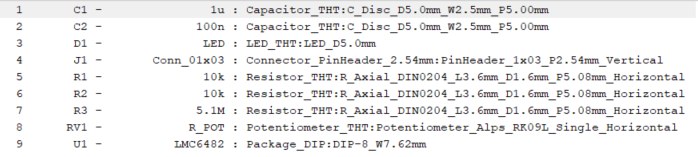

==================
Intro to KiCad Lab
==================
:authors: Kevin Zheng, Leon Wu, Jeffrey Ni, Hall Chen, Olivia Hsu

.. contents::
.. sectnum::

In this lab, we will design a printed circuit board (PCB) the LED light
sensor mentioned in the introductory lecture. Note that this lab is 
meant to be a very guided, very rapid intro walkthrough of the very basic 
processes needed to make a PCB in KiCad. Future labs and lectures will cover
each step more in depth.

`Back to HOPE main page <../../pcb.html>`_ 

Getting Started
===============
.. #. `Download and install KiCad <http://kicad-pcb.org/download/>`_.

#. Start KiCad.

#. File → New Project → New Project. A prompt will appear asking where to save
   your project. Choose a name and create your project.

Schematic Capture
=================

#. Open the 'Schematic layout editor' aka the 'Eeschema' app (1st from the left).

   .. image:: bar-schem.png

#. Thankfully, someone's cleaned up the messy hand-drawn schematic you saw earlier 
   in lecture. All you have to do is simply replicate the KiCad schematic below:

   .. image:: led-sensor4.png

Parts and Wiring
----------------

#. The first thing we want to do is add the components: resistors, op-amps, etc.
   Press '**a**' to bring up the parts Symbol library (or click the little op-amp
   in your right side-bar, then click anywhere in the schematic).
   In the filter bar, type 'LMC6482' to find the component.
   Open the drop-down and select 'Unit A'. Place the unit on the schematic. 
   Repeat with 'Unit B' and 'Unit C'.
   Place 'Unit C' only once. Press 'ESC' to exit insert mode.

   .. image:: placing_lmc6482.gif
      :height: 692
      :width: 704
      :scale: 75 %
      :align: center

   .. note::
   
      Interested in why the op-amps come as these separate units of one part? Take
      a look at page 18 of the 
      `LMC6482's datasheet <http://www.ti.com/lit/ds/symlink/lmc6482.pdf>`_ to get
      some idea of why the component would be set up this way. 

#. Flip Unit A vertically. Right click Unit A of the op amp and Orientation
   → Mirror across X axis.

    .. hint::

        Go to Help -> List Hotkeys... or press Ctrl+F1 (Win) to open up KiCad's
        built-in keyboard shortcuts cheat sheet! Note that the middle mouse
        can be used to drag your view in both the schematic and layout editor.
        This will help alleviate the headache of trying to scroll around either. 

#. Open the part symbol browser and search for 'R'. Find the generic resistor part symbol.
   Place 3 resistors as shown in the schematic.
   To rotate before placing, press '**r**' before placing the component. Hovering over a placed
   component and using '**r**' will also rotate it. Right click on any component to look at the
   other editing options avalible. 

   .. image:: rotating.gif
      :height: 692
      :width: 704
      :scale: 75 %
      :align: center

#. Continue by placing the following parts to match the completed reference schematic:
   
   - two capacitors ('C')

   - a LED part symbol ('LED')

   - a potentiometer part symbol ('POT')

   - a 1×3 connector part symbol ('CONN_01x03')

#. The following instruction is for wiring. Feel free to do step 8 first
   to get all pin-symbols on the schematic before starting to draw wires.
   
   To connect components: move your mouse to where you
   want to start a wire, press '**w**', click around to snap wire, and click on
   a pin to end the wire. Repeat until the schematic is fully captured.
   
   - Drag placed wires by hovering over them and pressing '**g**'. Delete segments
     by pressing '**Backspace**' or '**Del**', or right click any wires for more options. 

   - To create a wire that does not connect to a component on one end
     (floating), double click where you want the wire to end.

   - To add labels (the 'Vout' label shown above), press '**l**' and type in the
     name of your label. Labels connect two or more nodes together without
     actually drawing the wire on screen. They are basically magic wire tunnels
     linked by name.

   - Note that these wires do not *snap* to component pins. If you move or
     rotate a component, its seemingly connected wires will not follow. 

   .. image:: wiring.gif
      :height: 690
      :width: 1261
      :scale: 50 %
      :align: center

#. Now add power symbols to your schematic. Get these from the power symbol
   window by pressing '**p**' or finding its icon (a GND symbol) in the right toolbar. 

   - 5 voltage sources labels ('+3.3V')

   - 4 ground power labels ('GND')

   - Power flags ('PWR_FLAG')

   .. image:: power-flag.png
      :height: 706
      :width: 692
      :scale: 65 %
      :align: center

   For this step it may be easier to duplicate a component instead of adding
   multiple of the same component. To do this, hover your cursor over the
   component you want copied and press '**c**'.

#. Assign component values to components. For each resistor and capacitor,
   mouse over and press '**v**'. Or find it in the 'Properties' section in the 
   right-click menu. In the 'Text' field, type the appropriate value.
   Omit units.

#. Assign unique numbers to each component. Do this automatically by using
   Tools → Annotate Schematic → Annotate → OK.

.. sidebar:: Shortcuts VS UI Menus

    Feel free to use the interface menus to learn more about KiCAD's functions,
    or even to do this entire first lab. However, we recommend
    learning how to use the keyboard shortcuts, as doing so will speed up your
    work in future projects considerably. Also, you'll look much cooler. 

Footprint Assignment
--------------------
What should have been completed so far is the circuit **schematic**.
That is, we have transcribed our circuit's components and their connections
into a format that KiCad, and hopefully others, can understand. We now
need to tell KiCad what our parts look like physically on the board. First,
we need to assign what each component actually looks like in the real world.
Or at least, how they will look on our PCB. These representations are called
**footprints**. 

#. Go to "Tools → Assign Footprints". Note that it may take a while to open. 

   .. image:: assign-footprints.png

#. Pick the first unassigned footprint from **A**. If you want to assign
   multiple components with the same footprint, select multiple components
   using SHIFT-select.

#. In **B**, select the component library from which you want to select your
   footprint. For example, for components C1 and C2, you would probably choose
   either libraries "Capacitor_SMD" (surface-mount capacitors) or "Capacitor_THT"
   (through-hole capacitors).

#. Activate the footprint filters in **C**. Filter by the library "L" and the
   number of pins "#". You can further narrow down your search by adding key
   words in the text box to the right.

#. Select the appropriate footprint in **D**. Press **E** to preview selected
   footprints. Make sure to **double-click** on the footprint in the
   right panel assign it. 

#. Repeat these steps until all footprints are assigned.

#. Press "OK" to save and dismiss the window.

Use the following footprints: 

PCB Layout
==========

PCB Layout Setup
----------------

#. Inside the schematic layout editor, go to Tools → Update PCB From Schematic.
   This should open up the Pcbnew window and a popup window. Click 'Update PCB'

   .. image:: update-pcb.gif

   If you've done everything correctly so far, there should be no errors in the
   "Update PCB from schematic" window, as shown above. Your PCB layout window 
   should have opened up and should look like this:

   .. image:: pcb-editor.png

   Click somewhere in the PCB layout editor window to place down all the
   imported footprints. 

#. Let's do some basic environment setup before actually getting started.

   #. Make sure you're using the Modern Toolset. Preferences → Modern Toolset
      (Accelerated). 

   #. Also make sure you are set up to use inches. Press the "in" 
      button in the left sidebar. (Why the inferior imperial measurement system?
      Try searching around online if you're interested)

   #. Set your grid size (try a 50 or 25 mil grid). When working with 
      others' designs, using the same grid unit size as they do will help make sure your
      components and tracks line up with theirs.

   .. image:: basic-setup.gif

#. Get to the board setup window by File → Board Setup. Set Preset Layer Groupings to "Two
   layers, parts on front" in the 'Layers' page (default screen that the Board Setup 
   should open with). 

   .. note:: 
      For those with some PCB design experience, feel free to verify or set design rules
      such that you will guarantee that you board fall under `Bay Area Circuit's Standard
      Capabilities <https://bayareacircuits.com/capabilities/>`_ 

Placement and Rounting
-----------------------

   In the end we want something that looks like this:

   .. image:: led-sensor-pcb.png

   The red lines in the layout are called **tracks** or **traces**. They represent the
   physical connections defined by the connections made in the schematic doc. 

   Similarly, the red polygonal shapes are called **fills**, and represent large spans
   of copper that are also a way to represent wires in the schematic (usually power
   related wires). 

   The turquoise lines denote the silkscreen, which will be talked about later. 
   
   The gray boundaries denote component courtyards (F/B.CrtYd), or boundaries. If component
   courtyards overlap, a DRC error will occur since two components are trying to
   occupy the same place. 

#. First step is to move and orient components as you would like them to be on the board.
   It is recommended to position the op-amp IC first, and to keep the inputs/outputs 
   accessible at board edges. 
   Move components by mousing over them
   and pressing '**m**'. To rotate, type '**r**'. Click to place back down.

   .. image:: move-n-orient.gif

#. Finish placing components on the board. Feel free to place them however
   you wish, but try to minimize the number of crossing white wires. These
   wires (called the "ratsnest") indicate **intended** connections as defined
   in the schematic. 

   .. hint::

      Try disabling the view of the 'F.Fab' layer by unchecking its checkbox in the
      'Layer Manager' window on the right. It will help make things look neater. 

#. Swapping footprints: Let's say you're told that particular potentiometer won't 
   work with the project, and you're told to swap it out with another, differently 
   oriented potentiometer. 

   #. Go back to the schematic editor and reopen the 'Assign footprints' window. 

   #. Click on the potentiometer part in the footprint assignments, as reassign
      its footprint to be: "Potentiometer_Vishay_T7-YA_Single_Vertical"

   #. Save, then re-update the PCB from the schematic. In the 'Update' window
      **make 'Update footprints' checkbox is marked**. You should see that the 
      long potentiometer has changed to one that looks considerably different
      after the update. 
 
#. Routing: drawing out the physical connections between the components.
   **First, change your grid size to something smaller, such as 10 mil.**
   Switch to the track tool via the button in the right toolbar or by using 
   the keyboard shortcut '**x**'. You need to route a physical track
   for each white line you see connecting different pins. Use the 'Highlight
   Net' tool to easily visualize to-be-made and made connections. 

   .. image:: routing1.gif
   
   .. hint::

      Don't worry too much about GND connections in your routing, and do the other
      connections first. Take a peak at the next step about ground planes to 
      understand why!

   #. Delete segments by pressing '**Backspace**', or use '**Del**' to delete the
      full track, or right click for more options. 

   #. You may realize one layer might not be enough to ensure no overlaps. Use func.
      key '**Page Down**' to switch to the bottom layer. '**Page Up**' will return you to
      the top layer. You can use Vias (Vertical Interconnect Access), an
      electrical connection between multiple physical layers in a circuit board
      to connect traces on different layers. Note that because all the chosen
      component footprints are *through-hole*, that is, connected to the board
      via *via* like holes, independent vias are (ideally) unnecessary! 

      Vias are an avaliable option for you though: 
      Press '**v**' while in trace routing
      mode (i.e. you're in the middle of routing a trace and want to jump to
      the other layer) or find the 'add via' button in the right tool panel to
      add vias.

      .. image:: changing-layers.gif

   #. If you find it hard to draw out traces for all the connections, feel free
      to move and reorient the components themselves (or change them out completely, 
      if you feel this is necessary). PCB design is an iterative process!
      Don't feel down if you have to restart completely. PCB layout routing is a 
      computationally difficult problem after all. With practice you will be able 
      to arrive at more optimized layouts sooner, and this course go over some
      general practices and essential tips when approaching PCB layout. 

   .. note:: 

      Feel free to do whichever you want first: ground plane or edge cuts (board 
      outline). Edge cut instructions can be found right after the ground plane
      instructions. 

#. It is time to add a ground plane/ground pour to this board on both the top
   and bottom layers. A ground plane is a fill of copper dedicated entirely to the 
   GND net. It is *generally* a good idea because it makes
   routing easier and reduces ground noise. To do this:

   #. Set your grid size to something large, 50 mil+. This will make forming a neat
      pour polygon easier. 

   #. Click the 'Add filled zones' icon on the right-hand side toolbar then click 
      on the screen where you want the first corner of your ground plane to be.
      A settings window should pop up. Select 'F.Cu'/'B.Cu' for Layer and 
      'GND' for Net. Don't worry about the other settings for now. 

   #. Draw the ground plane polygon. Make sure it encompasses all the parts and traces, 
      make extend beyond your edgecuts, if you did them first.
      It does not hurt at all to go big, the edge cuts will "trim" it neatly for us. 

   #. Finish drawing the ground plane by clicking the other four corners of the
      polygon. Double click on the last corner to close the polygon.

      .. image:: pour.gif

   #. Repeat the above steps again to make a second ground plane for the other
      copper layer ('F.Cu' or 'B.Cu' that you have not yet done). 

   #. If you update any other part of your board (add new traces, move a component,
      etc.), press '**b**' to re-fill all filled zones. If you find the filled zones 
      visually impairing, you can unfill with 'ctrl+b' or change how they are viewed.
      Fill visibility buttons exist on the left toolbar, try to find them!

#. Add edge cuts for the board. This is the physical boundaries of your board.
   Select the 'Edge.Cuts' layer and, using the trace tool, draw a rectangle
   that contains all the footprints and traces on your board. If you already did
   the ground planes, make sure that your edge cuts stay *within* the ground
   polygons. You may choose to draw rounded corners, too, or other fancy shapes 
   for the board outline if you would prefer to.

   .. image::edgecut.gif

#. Make sure that at least one of the ground planes (should be the one on the 
   bottom layer) is not cut up too much by signal traces. Use vias to 
   connect the top ground plane to the bottom. A good amount would be 1 via per 
   ground island (if completely isolated planes of copper exist on the top layer). 

#. You're almost done! Add to the board silkscreen (the identification layer). 
   This is the (usually) white lettering you find on circuit boards.

   #. PCB editors will always have component designators on the silkscreen, 
      but we can also put other symbols (like your name, a logo, a date,
      pin orientation information, etc.) on the board as well.

   #. To make placement easier, reduce your grid size. 

   #. To do this select 'F. SilkS' from the 'Layers' right pane. Select
      the text tool and click on your board. Type in your name, press 'OK', and
      place it on the board. Feel free to add more silkscreen art or text of your
      choice, but make sure not to overlap silkscreen of components or vias. 

      .. image:: silkscreen.gif
         :align: center

#. Once you are finished, perform a Design Rules Check. Inspect → Design Rules Checker
   → Run DRC or find the ladybug icon in the top toolbar. If you get a pop-up about 
   needing to 'refill zones', click 'OK'. After running DRC, KiCad will warn you if there
   are any errors with your board. Correct your design and re-run DRC until there are no 
   more DRC violations.

   .. image:: drc-good.png
      :height: 629
      :width: 699
      :scale: 75%
      :align: center

#. Admire your handiwork in 3D!. View → 3D Viewer.

.. image:: 3dpreview.png

Generating Fabrication Outputs
==============================
#. File → Plot. In the upper right-hand corner, change the "Output directory" to a new 
   subfolder inside your project folder. Name the new subfolder "outputs" or
   something similar. Click 'yes' if KiCad asks if you want to use relative paths.
   Then to hit the 'Plot' bottom at the bottom right corner of the screen. 

#. (Bottom right corner of Plot window) Generate Drill Files → Generate Drill File

   Don't worry about the options in either output window.

   .. image:: outputs.gif

#. The output files, in their own folder, and now easily packagable to send off to
   manufacturing! Zip up folder and name it something reasonable. 

Lab Checkoff
============

Make sure you have...

   - Completed schematic (match the reference at the top of the page

   - Completely routed PCB layout (no remaing ratsnest lines, has ground planes, etc.)

   - Some custom silkscreen on the front side of the board

   - Proper board edges defined 

   - No DRC errors

   - Generated output files (gerbers: .gbr, and drills: .drl) in a compressed file. 

Submit a lab checkoff `here <https://forms.gle/ssFx9unnRbMy6nQM8>`_ 

Show your DRC report, layout, schematic, and output files to an instructor
to get checked off. 

`Back to HOPE main page <../../pcb.html>`_ 

