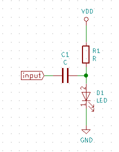

========================
Communicating with Light
========================

.. contents::
.. sectnum::

In this lab, you will use light to transmit and receive AC signals.

**Equipment:**

- Function generator
- Oscilloscope
- Power supply

**Materials:**

- 2 LEDs of the same color
- Mini breadboard
- Op amp
- Various resistors and capacitors
- Wire

Transmitter
===========
Build a circuit to light up an LED with an AC-coupled signal input:

Choose the value of *R* as you did in previous labs. Start with 0.1 uF for
*C*, though you may adjust it as needed. Make sure the circuit functions when
the input is grounded.

Set the function generator to high-Z mode. Apply a 100 mV peak-to-peak sine
wave at 10 kHz. Can you tell a signal is being generated? Probe the input of
the LED using an oscilloscope. What does the signal look like?

Receiver
========
On a separate board, build an `LED light sensor <lab8.html>`_ from last week's
lab. **Do not include the output comparator.** You may also design your own
circuit for better performance, but please have an instructor review your
schematic first. Test your circuit and sensor before moving on.

Place the receiving LED on the breadboard bent sideways so that it points at
the transmitting LED and vice versa. Turn on the function generator on the
transmitter and observe the output of the receiver. What do you see?

Demonstrate your transmitter and receiver to an instructor.

How far can you move the receiver before the signal on the receiver goes away?
How can you improve the range of communication? Try it.
