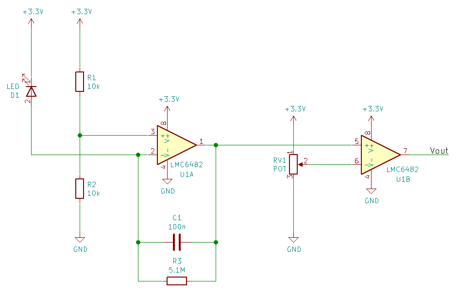

================
LED Light Sensor
================

.. contents::
.. sectnum::

Light-emitting diodes (LEDs) are usually designed to emit light, but because
they have an exposed diode junction, they can double as light sensors, too.

In this lab, you will build an analog signal conditioning and processing chain
for an LED light sensor.

Simulation
==========

This circuit can be divided into two logical blocks:

- **U1A** is a trans-impedance amplifier (TIA) that converts and amplifies the
  photocurrent from the LED into a voltage.

- **U1B** compares the analog voltage from the TIA with a threshold set by
  **RV1** and outputs either +3.3V (HIGH) or 0V (LOW) based on its decision.

.. note::
  If you already know what you're doing, here are abbreviated instructions:

  Build the circuit in a simulator of your choice. Use the `LMC6482 PSPICE
  model <http://www.ti.com/product/LMC6482/toolssoftware>`_ from TI in your
  simulation. Model the LED as a current source with a 1 nF capacitor in
  parallel.

  #. What is the static power consumption?

  #. What is the trans-impedance gain of the TIA?

  #. What is the 3dB bandwidth of the TIA?

  #. Why shouldn't you place a large capacitor at the output of the TIA?

  #. What is the voltage offset of the comparator?

  #. When the comparator is already HIGH, how long does it take to swing LOW?

  Check your simulations with an instructor and proceed to prototyping.

Comparator
----------
`Build and simulate <http://www.falstad.com/circuit/circuitjs.html>`_ the
comparator. Include U1B and RV1. Be prepared to answer the following:

#. How does this circuit act as a comparator?

#. How must you set RV1 for the comparator to make the correct decision?

TIA
---
`Build and simulate <http://www.falstad.com/circuit/circuitjs.html>`_ the TIA.
Include U1A, R1, R2, R3, and C1. Replace D1 with a current source of 100 nA.
Be prepared to answer the following:

#. What is the voltage at the non-inverting (+) terminal of the op amp? What
   components is it set by?

#. What is the trans-impedance gain (voltage at the output divided by current
   at the input, in units of volts per amp) of the amplifier? What components
   is it set by?

#. If the dark current of the diode is 1 nA, and the light current of the
   diode is 100 nA, how should you set the comparator threshold to make the
   correct decision?

#. How does C1 affect the behavior of the circuit?

Prototype
=========
Build and test the circuit on a solderless breadboard. Use a supply voltage of
3.3 V. Add an LED in series with a 100 Ohm resistor at the output of the
comparator. Adjust RV1 as necessary to correctly threshold based on ambient
light conditions.

You will be using the LMC6482 op amp. Each package has two op amps inside. Use
the `pin function diagram
<http://www.ti.com/product/LMC6482/description#diagrams>`_ when building the
circuit.
