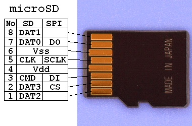

======================
Microcontroller Design
======================

In this lab, you'll create a "flight computer" for some space application. We will start off with an existing microcontroller design, the schematic and (variant) layout of the MSP430F5529 LaunchPad! 

.. contents::

Using Existing Schematics and Layouts
=====================================
Incredibly good time-saving strategy: don't reinvent the wheel if you don't need to. Piggyback off the work of others!

Take a look at the product site of the official `MSP430F5529 USB Launchpad Evaluation Kit <http://www.ti.com/tool/msp-exp430f5529lp>`_. This is the microcontroller our "flight controller" will be using. Notice the "Design Files" download avaliable on the webpage. 

KiCAD provides its users with the ability to import project files from other PCB design software (specifically EAGLE). Normally, this would be done by doing File -> Import Project in the Project window. Unfortunately, the most recent stable release of KiCAD (5.0.2) has a bug importing this particular design file from Texas Instruments. But know you can do this and probably definitely should for your own project if such evaluation board files are avaliable.

To save you time and frustration, a prepared starter KiCAD project is avaliable for you to download from `here <https://www.google.com>`_ that contains a simple MSP430F552 circuit. 

#. Take a look at both the schematic and PCB layout. Are there any problems with either? 

   .. hint::

      Use ERC, DRC, and common sense! This is not a trick question and is meant to get you to know how to look at other people's circuits. 

#. 

Adding Sensor Functionality
===========================
The board is pretty empty outside of just the microcontroller chip itself, its periperial components, and some general purpose connections. We want to use the microcontroller to do cool things, like record information about the state of our satellite. 

For this lab, your job is to add an `6-DOF IMU <https://www.invensense.com/products/motion-tracking/6-axis/icm-20689>`_ and `microSD card slot <https://www.molex.com/molex/products/datasheet.jsp?part=active/1051620001_MEMORY_CARD_SOCKET.xml&channel=Products&Lang=en-US>`_ to the provided microcontroller circuit. The IMU can record information such as the rotation of our satellite, and an SD card can be used to save the information for later use. 

SPI communication
-----------------
Both of these devices utilize the SPI serial communication protocol, which stands for Serial Peripheral Interface. 

.. sidebar:: IMUs and DOFs

    IMU stands for Inertial Measurement Unit. These devices contain accelerometers and gyroscopes (and in some cases magnetometers). They are the sensors that detect motion aka changes in inertia. DOF stands for Degrees of Freedom. In the case of IMUs, DOF refers to the number of independently measureable properties. A 3-DOF IMU can have joint measurements in 3-dimensions, or translational space. A 6-DOF IMU adds rotation measurement to the existing axes. 

microSD Info
------------

When hooking up the microSD header, utilize this helpful image

Insense IMU Info
----------------

 
