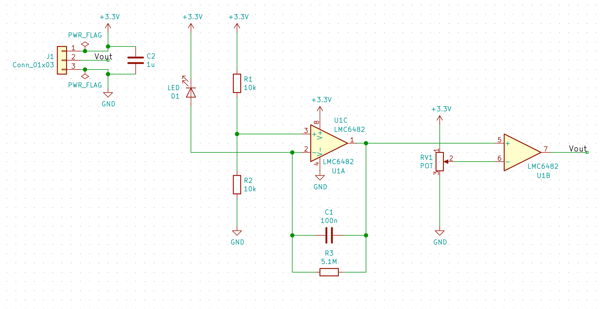

=====================================
Building Interfaces To The Real World
=====================================

---------------------------------------------
A crash-course on analog systems and circuits
---------------------------------------------

:author: Kevin Zheng

.. footer:: Kevin Zheng

.. include:: <s5defs.txt>

Last Week
=========
What did we do last week?

.. class:: incremental

- Realizing logic gates using circuit devices

- Making a lot of circuit devices very cheaply

This Week
=========
Building interfaces between our computing devices and the real world

Analog
======
*analog (adj.)* of, relating to, or being a mechanism in which **data is
represented by continuously variable physical quantities**

.. image:: https://upload.wikimedia.org/wikipedia/commons/thumb/f/fd/Analog_watch_2.jpg/170px-Analog_watch_2.jpg

.. image:: https://upload.wikimedia.org/wikipedia/commons/thumb/e/eb/Digital-clock-alarm.jpg/220px-Digital-clock-alarm.jpg

Physical Quantities
===================
Which of these physical quantities are *analog*?

.. class:: incremental

- How far? (distance)
- How fast? (speed)
- How long? (time)
- How warm? (temperature)

.. class:: incremental

Almost all the physical quantities we want to measure are analog!

Processing Information
======================
Most information is processed, stored, and communicated *digitally*.

*digital (adj.)* property of **representing values as discrete numbers**
rather than a continuous spectrum

`Why?` `Digital signals:`

.. class:: incremental

- Can be represented on a computer

- Are resistant to degradation

- Are more precise in computation

Making Measurements
===================
Most analog-to-digital converters (ADCs) can only operate on voltages.

- To measure a physical quantity, use a process that converts that quantity to
  a voltage

.. class:: incremental

How can we measure...?

.. class:: incremental

- Distance: `radar, lidar, ultrasound`

- Speed: `magnetic coil`

- Time: `quartz crystal`

- Temperature: `thermocouple`

What's Voltage?
===============
- A difference in electric potential, :math:`\Delta V`

- Measured in Volts (V)
  
  - 1 V = 1 Joule per Coulomb

- In conductors, obeys Ohm's Law: :math:`\Delta V = IR`

.. image:: https://upload.wikimedia.org/wikipedia/commons/thumb/2/25/Electrostatic_definition_of_voltage.svg/220px-Electrostatic_definition_of_voltage.svg.png

.. image:: https://upload.wikimedia.org/wikipedia/commons/thumb/d/de/OhmsLaw.svg/150px-OhmsLaw.svg.png

Converting Analog to Digital
============================
#. Measure a physical quantity using an analog process

#. *Condition* the analog information using analog systems

#. Convert analog information to digital information using an ADC

Signal Conditioning
===================
Most signals must be *conditioned* before processing by an ADC.

Signals might:

- Be very weak

- Have a lot of noise

- Contain more information than we can process

Analog Toolbox
==============
ADCs
  Convert analog signals to digital ones

Amplifiers
  Increase the signal level

Filters
  Reduce noise in signals

Isolators
  Protect sensitive circuits from damage

ADCs
====
- Convert analog signals to digital ones

- Have limited speed (*bandwidth*, measured in Hertz)

- Have limited *precision* (measured in bits)

Amplifiers
==========
- Increase the signal level by a ratio called *gain*

- Built using *active* devices—devices that consume power

.. image:: https://upload.wikimedia.org/wikipedia/commons/thumb/9/97/Op-amp_symbol.svg/200px-Op-amp_symbol.svg.png

Filters
=======
- Reduce noise by *attenuating* uninteresting signals *out-of-band*

- Available in low/band/high-pass or notch varieties

- Built using *networks* of resistors, capacitors, inductors

- Can be combined with active devices to make *active filters*

.. image:: https://upload.wikimedia.org/wikipedia/commons/thumb/e/e0/1st_Order_Lowpass_Filter_RC.svg/250px-1st_Order_Lowpass_Filter_RC.svg.png

Integrated Circuits
===================
- All of these components are often realized as integrated circuits

- In many cases, multiple components on the same chip

- Integration increases speed, performance, reliability; reduces cost

Lab
===
Ambient light sensor with binary output and adjustable threshold

